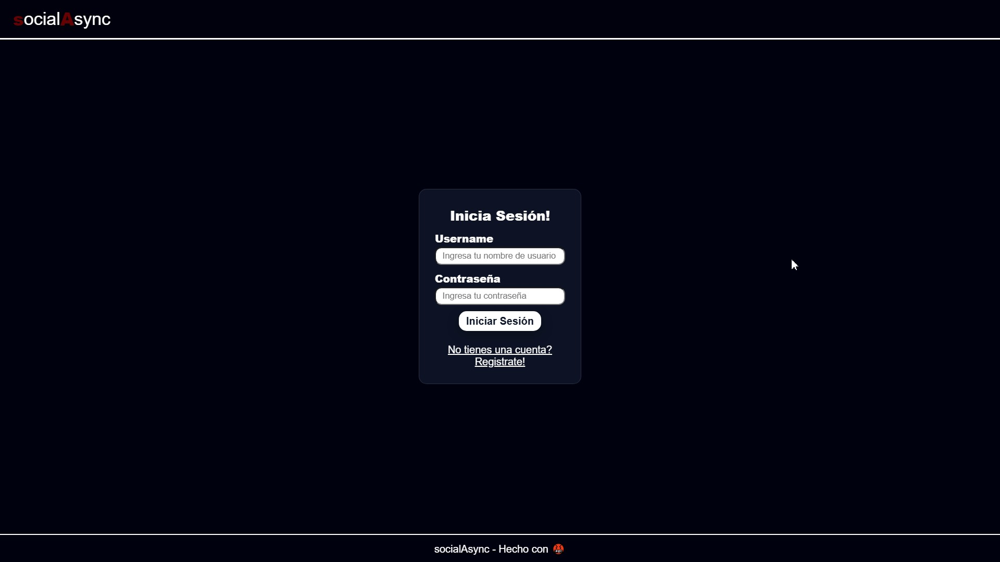
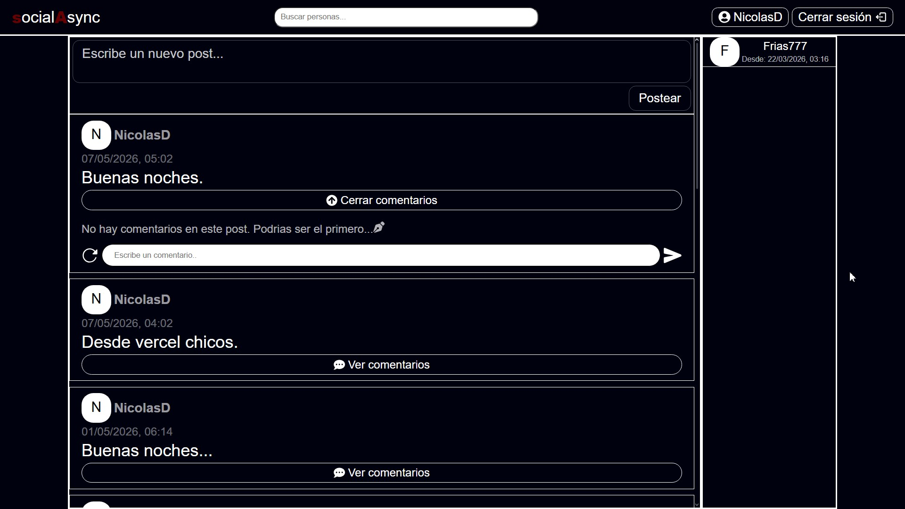

# socialAsync Frontend

Frontend de **socialAsync**, una pequeña red social desarrollada como proyecto de práctica full stack utilizando React.

> 🚧 El desarrollo activo del proyecto se encuentra actualmente en pausa.
>
> socialAsync alcanzó el objetivo con el que fue concebido: servirme como proyecto para aprender y practicar el desarrollo de aplicaciones full stack modernas.
>
> La aplicación ya cuenta con todas las funcionalidades principales previstas y es completamente utilizable. En el futuro planeo retomar el proyecto para realizar mejoras internas, refactors y optimizaciones de arquitectura, pero por el momento no se encuentran planificadas nuevas funcionalidades importantes.

---

## 🌐 Deploy

El frontend se encuentra deployado en Vercel:

https://social-async-frontend-react.vercel.app

---

## 🚀 Funcionalidades actuales

Actualmente el frontend permite:

* Registro de usuarios
* Login
* Persistencia de sesión mediante JWT
* Visualización del feed
* Creación de posts
* Eliminación de posts
* Comentarios en publicaciones
* Eliminación de comentarios
* Navegación mediante React Router
* Sistema de amistades
* Solicitudes de amistad
* Búsqueda de usuarios
* Visualización de perfiles
* Responsive design

---

## ⚠️ Estado actual del proyecto

Desde el punto de vista funcional, el proyecto se considera finalizado.

Las tareas pendientes corresponden principalmente a mejoras internas de código, organización y mantenibilidad, por lo que no afectan el uso normal de la aplicación.

### Mejoras futuras

* Refactorización de componentes.
* Mayor separación de responsabilidades mediante custom hooks.
* Optimizaciones generales de la arquitectura y del código.

---

## 🛠️ Stack utilizado

### Frontend

* React
* Vite
* Redux Toolkit
* RTK Query
* React Router
* Styled Components
* Formik
* Yup

### Backend/API

El frontend consume una API REST desarrollada con:

* Node.js
* Express
* TypeScript
* MongoDB
* JWT

Link al repositorio del backend: https://github.com/FxShin0/socialAsync

Documentacion de la API: https://documenter.getpostman.com/view/45555457/2sBXqNkyDN#intro

---

## 🔐 Autenticación

Actualmente la autenticación se maneja utilizando JWT almacenados en `localStorage`.

Sé que no es la solución más segura comparado con cookies `httpOnly`, pero prioricé simplicidad y velocidad de desarrollo para enfocarme principalmente en practicar React y la comunicación frontend/backend.

---

## 📦 Instalación local

```bash
npm install
npm run dev
```

---

## 🎯 Objetivo del proyecto

La idea de socialAsync fue crear una red social pequeña pero suficientemente compleja como para practicar:

* Manejo de estado global
* Consumo de APIs
* Autenticación
* Routing
* Arquitectura frontend/backend
* Manejo de formularios
* Validaciones
* Diseño de componentes reutilizables

---

## 📌 Notas

* El proyecto utiliza una interfaz oscura por diseño, por lo que no planeo agregar light mode.
* Muchas partes del código todavía necesitan refactors y desacoplamiento de lógica/renderizado.

---

## 📷 Capturas

### Login




### Feed



---

## 📚 Estado del proyecto

🚧 En pausa.
